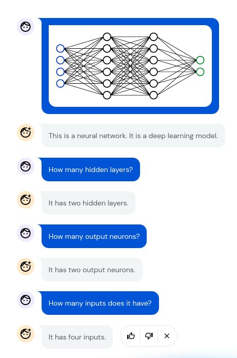

# Flamingo

[Flamingo](https://www.deepmind.com/blog/tackling-multiple-tasks-with-a-single-visual-language-model) is a visual language model developed by DeepMind on April 2022. After the
release of the paper and blogpost some impressive dialogs have been shown on twitter.

Flamingo is able to receive text, images and video interleaved and returns text as output.

## How it works?

As a start point they train a visual only and text only models. The visual model is trained like OpenAI's CLIP. Those models are then frozen and introduced as modules in a new and bigger model
that learns to combine the text and visual information. This new model is trained on multimodal
datasets gathered from internet.

## Thoughts

It is likely that the same architecture could be used to integrate audio as input and maybe other
kind of inputs.

The published results show signs of reasoning and understanding of the inputs. I find it very surprising the abilities to count objects and to describe the position of the objects. As far as
I remember Dall-e 2 struggle with this abilities because CLIP objective does not capture that information.
